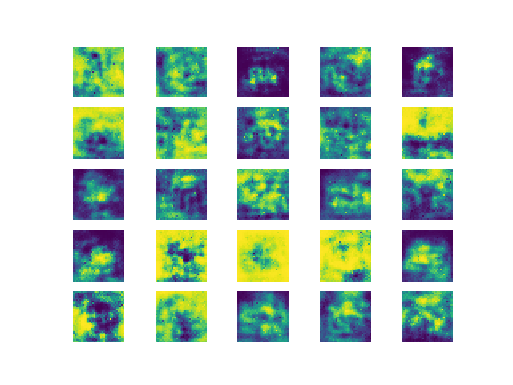
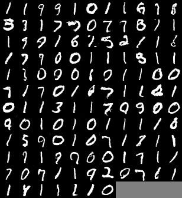
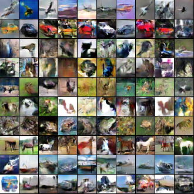

## CS 66 Final Project Lab Notebook

Name 1: Tai Thongtai

Name 2: Sam Yan

Name 3: Richard Chen

userId1: nthongt1

userId2: syan2

userId3: rchen2

Project Title: Simulating Datasets with GANs

---
### Rich, Sam, Tai: 04-28-19 (2hrs)
- Looked up examples of GANS and how it works
- Copied example of MNIST GANs file to be altered for our dataset
    - Credit Link: https://github.com/jacobgil/keras-dcgan/blob/master/dcgan.py?fbclid=IwAR3qgjN5ZrcyCruhw3S3IgVd3b02NsIGO-sMi-2dQKLRNTyHZxFVVI7q1pU
- Read over file and tried to interpret usage for our data

### Rich, Sam, Tai: 04-30-19 (2hrs)
- Learned and Researched Adam Optimizer
    - Link: https://machinelearningmastery.com/adam-optimization-algorithm-for-deep-learning/
- Learned tf.keras.layers.Dense function
    - Link: https://www.tensorflow.org/api_docs/python/tf/keras/layers/Dense
- Learned LeakyReLu and its advantage over ReLu
    - Link: https://www.quora.com/What-are-the-advantages-of-using-Leaky-Rectified-Linear-Units-Leaky-ReLU-over-normal-ReLU-in-deep-learning
- Learned .summary() function
    - Link: https://machinelearningmastery.com/visualize-deep-learning-neural-network-model-keras/

### Sam, Tai, Rich: 05-01-19 (3.5hrs)
- Tried to fine tune the original code final to run cifar-10
- Changed some code and successfully read cifar-10
- Altered parameters to better fit cifar-10
- Result after 10000 epochs:

- Image isn't successfully training -- might need to switch to a better format/github repo

### Tai, Sam, Rich: 05-04-19 (2hrs)
- Researched other codes and tried to learn what made other code better

### Rich, Tai, Sam: 05-06-19 (4hrs)
- Overwritten what we had and tuned parameters to run mnist better
- Tried to better understand functions in Keras
- Thinking that we might move to mnist and try to better it since cifar-10 isn't fairing well
- Still tried to run cifar-10

### Tai, Sam, Rich: 05-07-19 (7hrs)
- Since our code isn't working well after many tries and fine-tuning, we decided to change the
original github repo code.
- Researched and tried to find other code
  - Note: Many codes found online have different libraries installed that are different from what is installed
  on our school computer. Finding a well-working GANs program that runs with our school computer took a very long
  time to find
- Eventually found codes that ran and produced both MNIST and cifar-10 datasets

### Tai, Sam, Rich: 05-10-19 (5hrs)
- Tried to understand the code that we git pulled
- Fine-tuned parameters to better our results
- Trial-by-error many of the parameters until the codes ran smoothly on the lab computers
- Cifar-10 Steps:
  - Cloned the Gans repo.
    -  https://github.com/King-Of-Knights/Keras-ACGAN-CIFAR10
    - (Minibatch.py and cifar10.py is required)
    - renamed cifar10.py as gans.py
  - Cloned the Lab 07 repo.
  - Changed the code such that the weights only save every 50 epoch to keep disk quota low.
  - Ran the code for a day and a half (1000 epochs).
  - Went back into the code and loaded back the weights for the 951th epoch (didn’t end up saving the 1000th epoch)
  - Make load_weight = True and load_epoch = 951 (initially set to False)
  - Added “np.save('cifar_image_data_{0:03d}'.format(load_epoch), generated_images)” to save the generated dataset as a npy array. Saved 10 generated npy arrays to have 1000 train examples.
  - Made a file called make_dataset.py which combines the npy arrays into one array. Also creates the labels.
  - Creates the final png which contains 1000 images.

### Sam, Tai, Rich: 05-12-19 (~39.5hrs training; 6hrs understanding/tuning/working)
- Ran cifar-10 all day (for two days) and trained
- Check on how the training was working every few hours
- Sometimes ran into segfaults due to lack of memory.
  - After reading through the code and trying to understand, we found that the code was saving its weights
  and other necessary parameters along with the history of training every epoch. This turned out to be the reason
  why we ran out of memory so fast (even with the virtual machine).
  - We ended up changing code around so it wouldn't save every epoch, but after every few hundred epochs are so. A few parts       is done by trial and error
- Continued running code.
- We found that the images were "plateau-ing" in terms of better quality, but we continued to train
- Found that we were able to recognize the images from afar... probably because cifar-10 data is 32 pixels by 32 pixels
- Here are some of the results:
  - MNIST: (After 1000 epochs)
  
  - Cifar-10: (After 1000 epochs)
  

### Tai, Sam, Rich: 05-13-19 (~24hrs training; 2hrs understanding/working)
- Figured out how to save weights
- Figured out how to concatenate data
- Understand some of the code that runs the mnist dataset
- Learned .npy file types
- Trained the dataset for ~24 hrs

### Rich, Tai, Sam: 05-15-19 (9hrs) 
- Analyzed both generated cifar10 and mnist datasets
- Hand-labeled mnist dataset (so painstaking) for preprocessing to analyze GANs
- Found that when using generated mnist data to classify, the accuracy rate is ~25%
  - We first predicted that it might be due to human-error (aka 'mis-labeling' each datum)
  - To test this, we shuffled the labels of the generated mnist file so none of the labels
  match the generated image. The result wasn't too much better, eliminating human error
  - Created and finalized the powerpoint presentation
  - Used the generated images of both cifar-10 and mnist
  - Cifar-10 Changes:
    - With the new npy arrays (from 5/10), we can load them into our lab07. 
    - Instead of loading the real cifar train data, load our generated dataset using    
      - X_train = np.load("X_train_cifar10.npy")
      - y_train = np.load("y_train_cifar10.npy”)
  - Analyzed the data and created the graphs and manually inputted labels for mnist
  - Made a confusion matrix for cifar dataset
  - Charts can be found in the presentation slides (in the repo)

Cited Sources: https://github.com/King-Of-Knights/Keras-ACGAN-CIFAR10/blob/master/README.md
               https://www.quora.com/How-do-I-extract-data-from-Excel-into-NumPy
               https://arxiv.org/abs/1806.02920
               https://machinelearningmastery.com/adam-optimization-algorithm-for-deep-learning/
               https://github.com/jacobgil/keras-dcgan/blob/master/dcgan.py?fbclid=IwAR3qgjN5ZrcyCruhw3S3IgVd3b02NsIGO-sMi-2dQKLRNTyHZxFVVI7q1pU
               https://www.tensorflow.org/api_docs/python/tf/keras/layers/Dense
               https://www.quora.com/What-are-the-advantages-of-using-Leaky-Rectified-Linear-Units-Leaky-ReLU-over-normal-ReLU-in-deep-learning
               https://machinelearningmastery.com/visualize-deep-learning-neural-network-model-keras/
               
